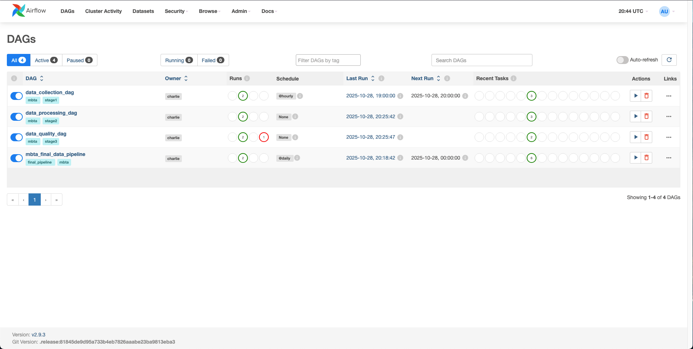
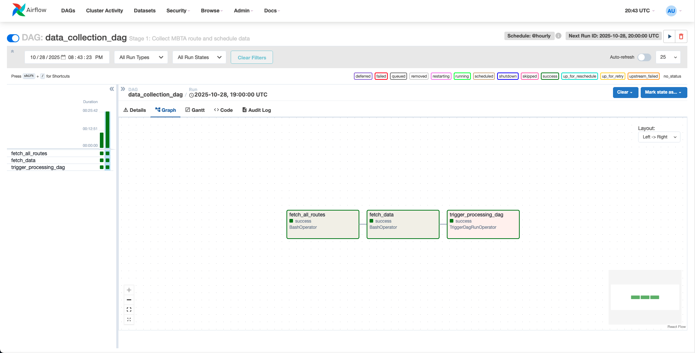
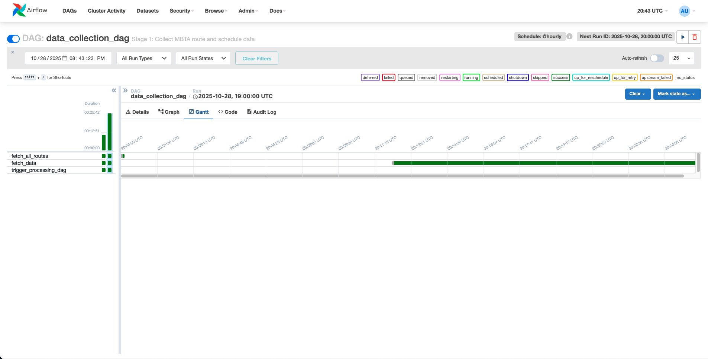
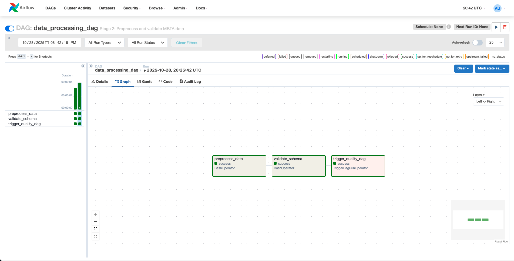
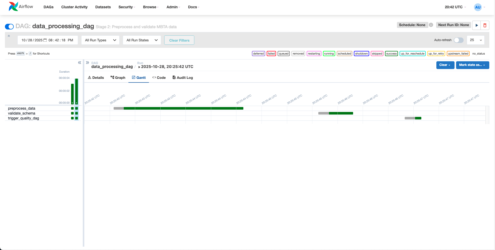
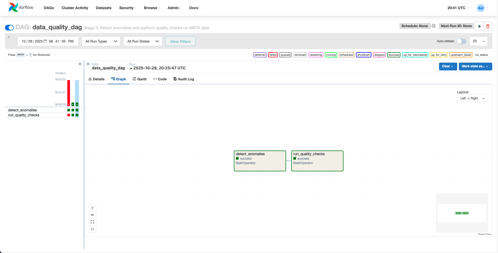
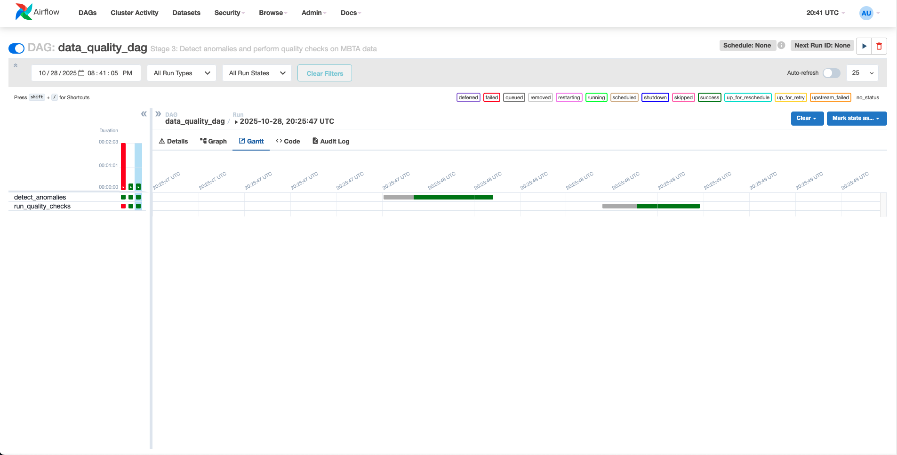
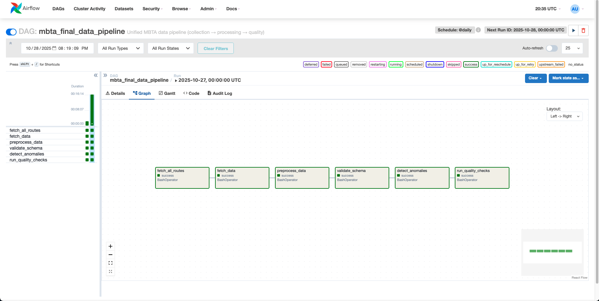
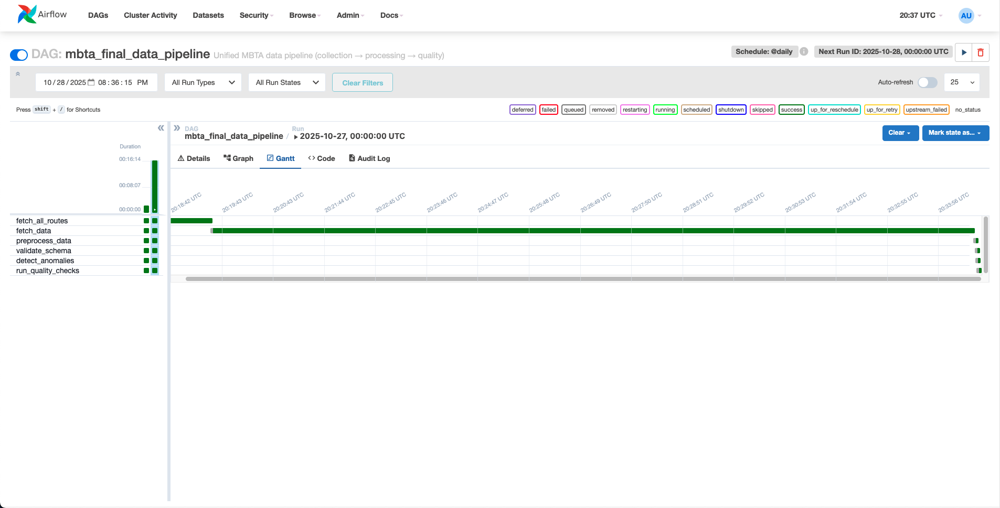

# Data Pipeline 

### **Author:** Group_22
### **Course:** IE 7374 — MLOps (Fall 2025)  

---

## Project Overview
This project implements a **modular, reproducible, and automated MLOps Data Pipeline** using **Apache Airflow** and **DVC**.  
The pipeline orchestrates the entire data lifecycle — from **data acquisition** to **bias detection**, including **schema validation**, **testing**, **versioning**, and **alerting**.  

All stages are integrated into Airflow DAGs to ensure reproducibility, traceability, and automation.

---

## ⚙️ Pipeline Stages

| Stage | Description | Key Scripts |
|-------|--------------|--------------|
| **1. Data Acquisition** | Fetches MBTA API data (routes, vehicles, alerts). | `fetch_all_routes.py`, `fetch_data.py` |
| **2. Data Preprocessing** | Cleans raw JSON, structures into CSVs. | `preprocess_data.py` |
| **3. Schema Validation** | Validates data structure & schema. | `validate_schema.py`, `validate_schema_tfdv.py` |
| **4. Data Quality & Anomaly Detection** | Detects missing values/outliers, raises alerts. | `detect_anomalies.py`, `run_quality_checks.py` |
| **5. Bias Detection** | Performs fairness checks using `Fairlearn`. | `detect_bias.py`, `visualize_bias_report.py` |
| **6. Data Versioning (DVC)** | Tracks all data versions and pipeline stages. | `dvc.yaml`, `dvc.lock` |
| **7. Orchestration (Airflow)** | Manages dependencies and execution flow. | `data_collection_dag.py`, `data_processing_dag.py`, `data_quality_dag.py`, `mbta_final_data_pipeline.py` |

---

## Folder Structure

```
/Charlie-main
│
├── dags/                               ← Top-level DAG definitions for Airflow orchestration
│
├── Data_Pipeline/
│   ├── dags/                            ← Stage-specific DAGs (data_collection, processing, quality, final)
│   ├── scripts/                         ← Python scripts for each pipeline stage
│   │   ├── fetch_all_routes.py          ← Fetches MBTA routes via API
│   │   ├── fetch_data.py                ← Collects vehicle and alert data
│   │   ├── preprocess_data.py           ← Cleans and structures data
│   │   ├── validate_schema_tfdv.py      ← Performs schema validation with TFDV
│   │   ├── detect_anomalies.py          ← Detects missing/outlier data and triggers alerts
│   │   ├── run_quality_checks.py        ← Performs automated quality tests
│   │   ├── detect_bias.py               ← Runs bias and fairness analysis
│   │   ├── visualize_bias_report.py     ← Visualizes bias metrics
│   │   └── utils.py                     ← Helper functions
│   │
│   ├── data/                            ← Dataset directory
│   │   ├── raw/                         ← Raw MBTA API responses
│   │   ├── processed/                   ← Cleaned & preprocessed datasets
│   │   ├── validation/                  ← Schema and anomaly reports
│   │   ├── all_routes.json              ← Sample fetched route data
│   │   └── all_routes.yaml              ← Route metadata
│   │
│   ├── tests/                           ← Unit testing modules (pytest)
│   │   ├── test_preprocess.py
│   │   └── test_utils.py
│   │
│   ├── logs/                            ← Airflow & custom Python script logs
│   ├── output/                          ← Generated data artifacts and final outputs
│   ├── params.yaml                      ← Central config for directories, thresholds, and schema
│   └── __init__.py
│
├── screenshots/                         ← Visual documentation (Airflow DAG Graphs & Gantt Charts)
│   ├── Airflow_Homepage.png
│   ├── Data_Collection_Dag_Graph.png
│   ├── Data_Collection_Dag_Gantt.png
│   ├── Data_Processing_Dag_Graph.png
│   ├── Data_Processing_Dag_Gantt.png
│   ├── Data_Quality_Dag_Graph.png
│   ├── Data_Quality_Dag_Gantt.png
│   ├── Final_Data_Pipeline_Graph.png
│   └── Final_Data_Pipeline_Gantt.png
│
├── docker-compose.yaml                  ← Multi-container orchestration for Airflow + Postgres
├── dockerfile                           ← Custom Airflow image build instructions
├── dvc.yaml & dvc.lock                  ← Data Version Control tracking files
├── .gitignore                           ← Git exclusion rules (includes .env, logs, data, etc.)
├── LICENSE                              ← License info (open-source compliance)
├── folder_structure.txt                 ← Exported tree structure for submission
├── requirements.txt                     ← Python dependency list
└── README.md                            ← Full project documentation
```

---

##  Airflow DAG Architecture

### 1️⃣ `data_collection_dag`
- Fetches MBTA routes, vehicles, and alerts every hour.  
- Triggers next DAG: `data_processing_dag`.

### 2️⃣ `data_processing_dag`
- Preprocesses raw JSON → structured CSVs.  
- Runs schema validation and triggers quality DAG.

### 3️⃣ `data_quality_dag`
- Detects anomalies, schema mismatches, and data drift.  
- Sends **email alerts** if issues cross thresholds.

### 4️⃣ `mbta_final_data_pipeline`
- Unifies all three DAGs using DVC for complete orchestration.

---

## ✉️ Email Alerts Configuration

Configured in `docker-compose.yaml` under all Airflow services:
```yaml
env_file:
  - .env
environment:
  - AIRFLOW__EMAIL__EMAIL_BACKEND=airflow.utils.email.send_email_smtp
  - AIRFLOW__SMTP__SMTP_HOST=smtp.gmail.com
  - AIRFLOW__SMTP__SMTP_STARTTLS=True
  - AIRFLOW__SMTP__SMTP_SSL=False
  - AIRFLOW__SMTP__SMTP_PORT=587
  - AIRFLOW__SMTP__SMTP_USER=${EMAIL_USER}
  - AIRFLOW__SMTP__SMTP_PASSWORD=${EMAIL_PASSWORD}
  - AIRFLOW__SMTP__SMTP_MAIL_FROM=${EMAIL_USER}
```

### Airflow Default Args
```python
default_args = {
    'owner': 'charlie',
    'depends_on_past': False,
    'email': ['ashokumar.g@northeastern.edu'],
    'email_on_failure': True,
    'email_on_retry': False,
    'retries': 1,
    'retry_delay': timedelta(minutes=5),
}
```

---

## Data Version Control (DVC)
The pipeline uses **DVC** for full reproducibility of data and intermediate artifacts.

Run any stage individually:
```bash
dvc repro fetch_routes
dvc repro preprocess
dvc repro validate
dvc repro anomalies
```

---

## Bias Detection
Implemented via **Fairlearn**:
- Measures **Demographic Parity Difference** and **Equal Opportunity Difference**.

---

## Testing
Unit tests implemented via **pytest**:

```bash
pytest -v
```

Tests cover:
- Data preprocessing validity  
- Schema compliance  
- Utility functions integrity

---

## Logging & Monitoring
- Centralized logging through Python’s `logging` module.  
- Airflow UI logs for DAG-level tracking.  
- Local logs stored in `Data_Pipeline/logs/`.

---

## Setup & Execution

### 1️⃣ Clone the Repository
```bash
git clone https://github.com/yourusername/Charlie-main.git
cd Charlie-main
```

### 2️⃣ Build and Launch Dockerized Airflow
```bash
docker compose build --no-cache
docker compose up -d
```

### 3️⃣ Access Airflow UI
Open: [http://localhost:8081](http://localhost:8081)

**Login:** `airflow / airflow`

### 4️⃣ Trigger the DAGs
Manually trigger `mbta_final_data_pipeline`.

---

## Screenshot (Airflow DAGs & Gantt Views)

Below are screenshots of the Airflow UI demonstrating the successful execution of each pipeline stage and the unified final DAG.

### Airflow Homepage


---

### Data Collection DAG
**Graph View:**


**Gantt View:**


---

### Data Processing DAG
**Graph View:**


**Gantt View:**


---

### Data Quality DAG
**Graph View:**


**Gantt View:**


---

### Final Unified Pipeline
**Graph View:**


**Gantt View:**

 ---

## References
- [Apache Airflow Documentation](https://airflow.apache.org/docs/)
- [DVC Documentation](https://dvc.org/doc)
- [Fairlearn Documentation](https://fairlearn.org/)
- [MBTA Developer API](https://api-v3.mbta.com/)

---

>>>>>>> f0fb034 (Add final Airflow MLOps Data Pipeline with DVC and Email Alerts)
